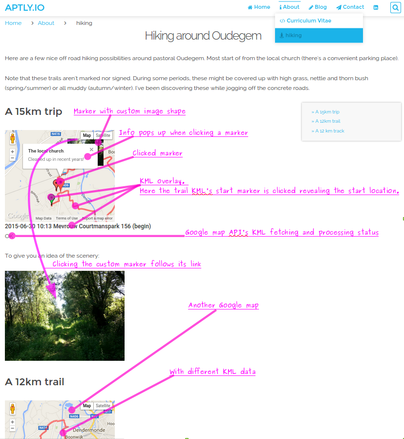

# [Grav Google maps Plugin][project]

This plugin generates HTML Google map object(s) based on specific markers in the markdown document.

## About

`googlemaps` is a plugin for [**Grav**](http://getgrav.org).
This readme describes version 0.3.5.
The plugin recognizes special marker(s) in a Markdown document.
It replaces these with HTML Google map object(s).
The Google map object is generated by using
[Google's Google maps API](https://developers.google.com/maps/documentation/javascript/tutorial).

The marker's syntax is `[GOOGLEMAPS:<tagid>]`.
The `<tagid>` distinguishes different Google maps objects in a single HTML page from one other.
With each `<tagid>` comes a [Grav page header]() settings to customize the Google maps object.
See this screen dump how this might look:

<a name="screendump">

(it's taken from my [website](https://aptly.io/about/hiking))
</a>


## Issues

Please open a new issue or request [here][issues].

### Known issues

- The map does not show up while you're sure all is configured correctly
(e.g. the same set-up worked for the old googlemaps plug-in version)? 
Some themes' templates are not completely up-to-date with the latest grav-core.
These typically miss the following twig source:

    ```twig
    
        {{ assets.js('bottom') }}
    
```

Please kindly ask the theme's original author to add `assets.js('bottom')` 
by referring to this plug-in and Grav's reference theme `antimatter`; 
more [specifically here](https://github.com/getgrav/grav-theme-antimatter/blob/develop/templates/partials/base.html.twig#L85)


- Grav's modular sub-pages have a limitation related to header assets for
the modular sub-page (see [#562](https://github.com/getgrav/grav/issues/562)).
When placing a googlemap on sub modular page, as a workaround:
  1. Prevent loading the css asset (it will not work anyway):

     ```yaml
googlemaps:
    built_in_css: false
```

  2. Instead add the css directly into the sub modular page with this style
(before the actual marker):

     ```css
<style type="text/css">
.googlemaps_container {
  position: relative;
  width: 100%;
  padding-bottom: 50%;
}
.googlemaps {
  position: absolute;
  width: 100%;
  height: 100%;
}
</style>
```

- There's a defect with a modular sub-page that has a ```googlemaps.enabled = false``` configuration;
it erases the Google maps assets of its earlier sibling modular sub-page(s).
The obvious workaround is to remove (e.g. comment out) the googlemap configurations
on any modular sub-page instead of using the ```googlemaps.enabled = false```.


## Installation and Updates

The Google maps plugin can be installed in 3 ways:

1. There's a manual install and update method by downloading
[this plugin](https://github.com/aptly-io/grav-plugin-googlemaps)
and extracting all the plugin's files in `</your/site>/grav/user/plugins/googlemaps`.

2. Use the `bin/gpm install googlemaps`

3. Use the admin plugin as a user with admin rights.


## Usage

The plugin comes with a sensible and self explanatory default plugin configuration.
Each page containing the `[GOOGLEMAPS:<tagid>]` marker can include  `<tagid>` specific configuration
to further customize the Google map with:

  - [marker(s)](https://developers.google.com/maps/documentation/javascript/markers)
  - [KML data layer](https://developers.google.com/maps/tutorials/kml/)

Each Google maps object corresponds with a unique `<tagid>` to render correctly.
For modular sub-pages, as these are joined into one single page,
make sure these `<tagid>` are all different as well.

The map's width is 60% of the window (and the height is proportional to this width)
(see the asset `googlemaps.css`). 


### Operation of the plugin

1. The plugin searches the `[GOOGLEMAPS:<tagid>]` markers.
1. It extracts the configuration in the page header that corresponds with the <tagid>
1. _Each_ marker is replaced with
   - a `<div id="<tagid>"></div>`
   - a global JavaScript snippet that calls a helper function
     `initGoogleMaps(<tagid>, <configuration for the specific tagid>)`

The helper function uses the Google map API to do the real work:
instantiate the googlemaps object inside the foreseen `<div>` with matching configuration.


### Configuration Defaults

```yaml
# Global plugin (and per-page) configurations

enabled: true                # Set to activate this plugin
built_in_css: true           # Use the plugin's asset `googlemaps.css`
```

If you need to change any value,
then the best process is to copy a modified version of the
[googlemaps.yaml](googlemaps.yaml) file into your `users/config/plugins/` folder.
This overrides the default (system wide) settings.

When setting `enabled` to `false` for a specific page, 
this plugin removes its specific `[GOOGLEMAPS:<tagid>]` markers to avoid that 
these markers would end up in the HTML output.


### Specific per page and map settings

Let's use the earlier [screen dump](#screendump ) to describe the configuration

The markdown content contains some markers (with `tagid`s: `track_01` and `track_02`)
```markdown
#### A 15km trip
[GOOGLEMAPS:track_01]

To give you an idea of the scenery:

<a name="treasures">

</a>

#### A 12km trail
[GOOGLEMAPS:track_02]
```

These `tagid` appear in the Grav page header under the `googlemaps` setting.
This allows customization as annotated in the earlier [screen dump](#screendump).
```yaml
googlemaps:
    track_01:
        center: 51.009314, 4.061254
        zoom: 12
        type: TERRAIN
        kmlUrl: https://aptly.io/user/pages/02.about/02.hiking/track_01.kmz
        kmlStatus: true
        markers:
            - location: 51.009358, 4.061578
              title: The local church
              zIndex: 1
              timeout: 1000
              info: <strong>The local church</strong>.<br/>Cleaned up in recent years!
            - location: 51.017227, 4.073198
              title: A secret passage
              zIndex: 2
              timeout: 2000
              icon:  https://aptly.io/user/pages/02.about/02.hiking/trail_nextto_railway_thumbnail.png
              link: "#treasures"
    track_02:
        center: 51.009314, 4.061254
        zoom: 12
        type: TERRAIN
        kmlUrl: https://aptly.io/user/pages/02.about/02.hiking/track_02.kmz
        scrollwheel: false
```

#### Explanation

* `center` defines the map's latitude/longitude center
* `zoom` sets the map's zooming (scale) factor
* `type` holds the map's type. Possible values are `TERRAIN`, `ROADMAP`, `HYBRID` and `SATELLITE`
* `kmlUrl` points to KML data. It's rendered over the map.
  Here the KML is exported (as KMZ; a compressed KML format) from the
  [My Tracks](https://play.google.com/store/apps/details?id=com.google.android.maps.mytracks&hl=en)
  Android application and copied on the website.
* `kmlStatus` is false by default.
   Enabled it for clues in case the KML layer is not showing up properly.
* `markers` is an array of markers. Each marker support these settings:
  * `location` defines the marker's location on the map. It's the only mandatory setting.
  * `title` is text that shows up when hovering over the marker.
  * `zIndex` gives a z order value to the marker (making it appear before or after other markers)
  * `timeout` delays the drop down animation of the marker. Fancy when multiple markers have different delays.
  * `info` is the content of a pop-up when clicking the marker. It's mutual exclusive with the `link` option.
    As illustrated, Google map API supports HTML markup inside this info.
  * `icon` points to a custom marker image.
  * `link` holds the URL that's triggered when clicking the marker. It's mutual exclusive with the `info` option.
    Put page local references in quotes to avoid that the # is taken as a YAML comment.

#### Additional configuration

Each Google map object has these additional properties (not illustrated in earlier's example):
 * `apiKey`: if using a [Google API key](https://developers.google.com/maps/signup)
 * `backgroundColor`: for a background colour (match this with your web-site's background colour)
 * `disableDefaultUI`: false disables the default UI controls
 * `disableDoubleClickZoom`: false disables zoom/center on double click
 * `draggable`: false disables dragging the map (associated customization options draggableCursor and draggingCursor are not supported)
 * `draggableCursor`: the name or url of the cursor to display when mousing over a draggable map
 * `draggingCursor`: the name or url of the cursor to display when the map is being dragged
 * `keyboardShortcuts`: false prevents map control from the keyboard, enabled by default
 * `mapTypeControl`: false disables the Map type control
 * `mapTypeControlOptions`: map type look and feel e.g. `{style: 2, position: 11}` for `DROPDOWN_MENU` at bottom center
 * `maxZoom`: maximal zooming
 * `minZoom`: mininmal zooming
 * `scrollwheel`: false prevents accidently zooming the Google map object while scrolling through the web page with the scrollwheel. 
 * `streetViewControl`: false disables the street view peg man (avoid for maps without street road overlay)
 * `streetViewControlOptions`: the streetview look and feel e.g. `{ position: 11}`
 * `zoomControl`: false disables the zoom control
 * `zoomControlOptions`: the zoom control look and feel e.g. `{ position: 11}`
 * `controlStyle`: set to `azteca` to enable the _retro_ Google maps control look.


## Development

A few notes on hacking the Google maps plugin.

The free IDE [Netbeans](https://netbeans.org/) is used for editing and debugging Grav and the `googlemaps.php` plugin code.
The free code editor [Visual Studio Code](https://code.visualstudio.com/) was used for editing `googlemaps.ts`. 
This TypeScript file was compiled into Ecmascript 5.0 as `googlemaps.js`
with the [`tsc`](http://www.typescriptlang.org/) compiler.

```bash
npm install # will install gulp and its dependencies defined in `package.json`
gulp        # runs the default task in gulpfile.js: minifying the js source
```

Use `system.debugger.enabled` to toggle back to the normal (not minified) googlemaps.js

## License

Copyright 2015, 2016 Francis Meyvis.

[Licensed](LICENSE) for use under the terms of the [MIT license][mit-license].


[project]: https://github.com/aptly-io/grav-plugin-googlemaps
[issues]: https://github.com/aptly-io/grav-plugin-googlemaps/issues "GitHub Issues for Grav Googlemaps Plugin"
[mit-license]: http://www.opensource.org/licenses/mit-license.php "MIT license"
